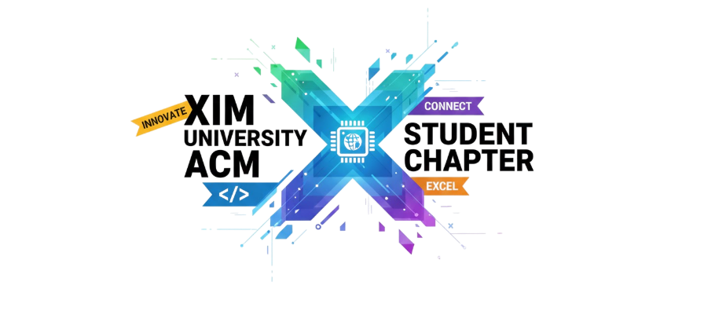

# ACM XIM Student Chapter Website

Welcome to the official repository for the **ACM XIM Student Chapter** website. This platform acts as the central hub for our community, showcasing events, team members, projects, and gallery highlights, all built with a modern, responsive, and aesthetically pleasing design.



## 🚀 Overview

This website is designed to be the digital face of the ACM Student Chapter at XIM University. It features:
- **Dynamic Event Management**: Showcases upcoming and past events with detailed descriptions and galleries.
- **Team Directory**: A dedicated page to meet the Faculty, Office Bearers, and Team Members.
- **Interactive Gallery**: A grid of memories from our various workshops and sessions.
- **Projects Showcase**: Highlights of technical projects built by our members.
- **Modern UI/UX**: Built with a "Glassmorphism" aesthetic, smooth animations, and a fully responsive layout.

## 🛠️ Tech Stack

This project is built using the following technologies:
- **Core**: [React](https://reactjs.org/) (v19)
- **Build Tool**: [Vite](https://vitejs.dev/)
- **Styling**: [Tailwind CSS](https://tailwindcss.com/) (v4)
- **Animations**: [Framer Motion](https://www.framer.com/motion/)
- **Icons**: [Lucide React](https://lucide.dev/) & [React Icons](https://react-icons.github.io/react-icons/)
- **Routing**: [React Router](https://reactrouter.com/)

## 📂 Project Structure

```bash
src/
├── assets/             # Images, videos, and static resources
├── components/         # Reusable UI components (Navbar, Loader, Cards)
├── events/             # Event listing and details pages
├── gallery/            # Gallery page implementation
├── landing/            # Landing page sections (Hero, About, etc.)
├── lib/data/           # Static data files (events, members, gallery links)
├── team/               # Team page implementation
├── App.jsx             # Main application component with Routing
└── main.jsx            # Entry point
```

## ✨ Key Features

1.  **3D Animated Loader**: A unique "Rolling Cube" and text reveal animation on startup.
2.  **Notification System**: Interactive notification cards in the Hero section.
3.  **Unified Team Styling**: Consistent blue theme across all sub-teams for a professional look.
4.  **Responsive Design**: Optimized for Desktop, Tablet, and Mobile views.

## 📦 Getting Started

Follow these steps to set up the project locally:

1.  **Clone the repository**
    ```bash
    git clone https://github.com/Kaifkhurshid7/acm-xim-website.git
    cd ACM
    ```

2.  **Install dependencies**
    ```bash
    npm install
    ```

3.  **Run the development server**
    ```bash
    npm run dev
    ```

4.  **Build for production**
    ```bash
    npm run build
    ```

## 🤝 Contributing

Contributions are welcome! Please feel free to submit a Pull Request.

1.  Fork the Project
2.  Create your Feature Branch (`git checkout -b feature/AmazingFeature`)
3.  Commit your Changes (`git commit -m 'Add some AmazingFeature'`)
4.  Push to the Branch (`git push origin feature/AmazingFeature`)
5.  Open a Pull Request

## 📄 License

Distributed under the MIT License. See `LICENSE` for more information.

---
Built with ❤️ by the **ACM XIM Tech Team**.